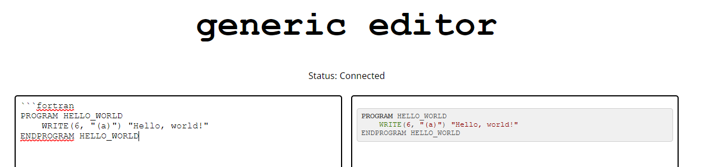
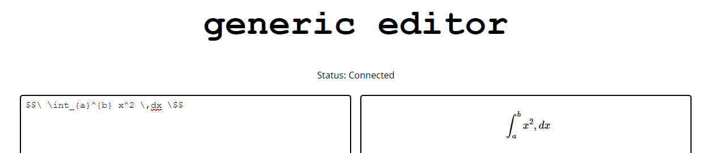

# generic editor

The generic editor is a way for people to collaborate over a document, exchange ideas, and write notes using markdown.

### Features
- Drag and drop file upload
- Syntax highlighting

- LaTeX support

### What we used
- node.js is used as our main way to write the server while HTML is used for the developing the webpage.
- Google Cloud Compute Engine is one of the main components along with websocket technology and nginx to allow the storage of documents
and images to the Google Cloud.
- Allowing users to collaborate on the same document was achieved using an operational transformation algorithm implemented by ShareDB.

### Demo
Warning this is **NOT MODERATED** [Demo](aaaaaaaaaaaaaaaaaaaaaaaaaaaaaaaaaaaaaaaaaaaaaaaaaaaaaaaaaaaaaaa.tech/?id=demo)
